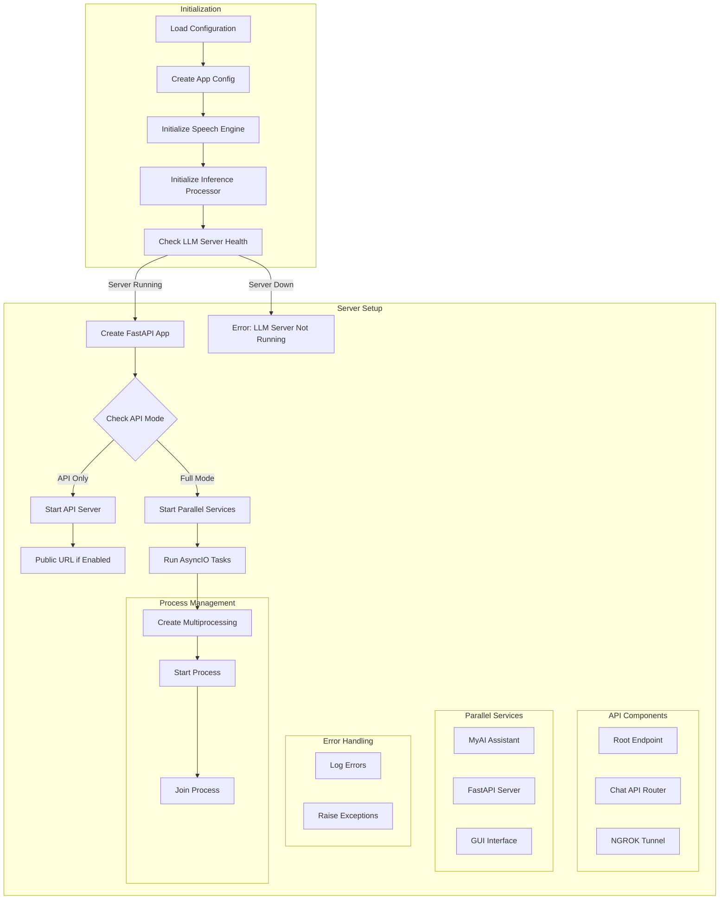

# MyAI Main Process Flow

```mermaid
flowchart TB
    subgraph Initialization
        A[Load Configuration] --> B[Create App Config]
        B --> C[Initialize Speech Engine]
        C --> D[Initialize Inference Processor]
        D --> E[Check LLM Server Health]
    end

    subgraph Server Setup
        F[Create FastAPI App] --> G{Check API Mode}
        G -->|API Only| H[Start API Server]
        G -->|Full Mode| I[Start Parallel Services]
        
        subgraph API Components
            J[Root Endpoint]
            K[Chat API Router]
            L[NGROK Tunnel]
        end
        
        subgraph Parallel Services
            M[MyAI Assistant]
            N[FastAPI Server]
            O[GUI Interface]
        end
        E -->|Server Running| F
        E -->|Server Down| P[Error: LLM Server Not Running]
        
        H --> Q[Public URL if Enabled]
        I --> R[Run AsyncIO Tasks]
        
        subgraph Error Handling
            S[Log Errors]
            T[Raise Exceptions]
        end

        subgraph Process Management
            U[Create Multiprocessing]
            V[Start Process]
            W[Join Process]
        end
    end

    

    R --> U
    U --> V
    V --> W
```