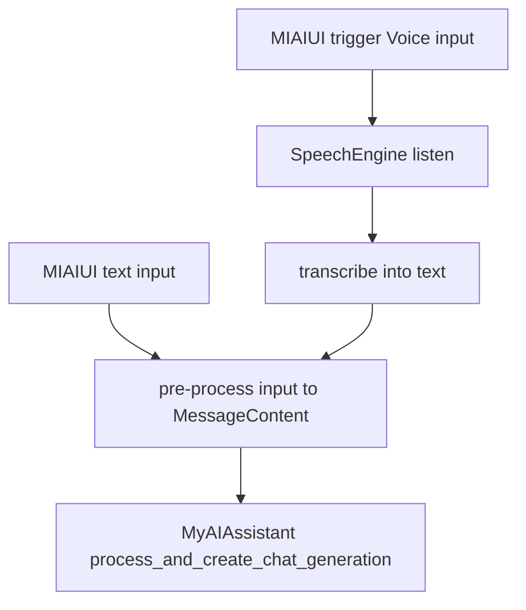
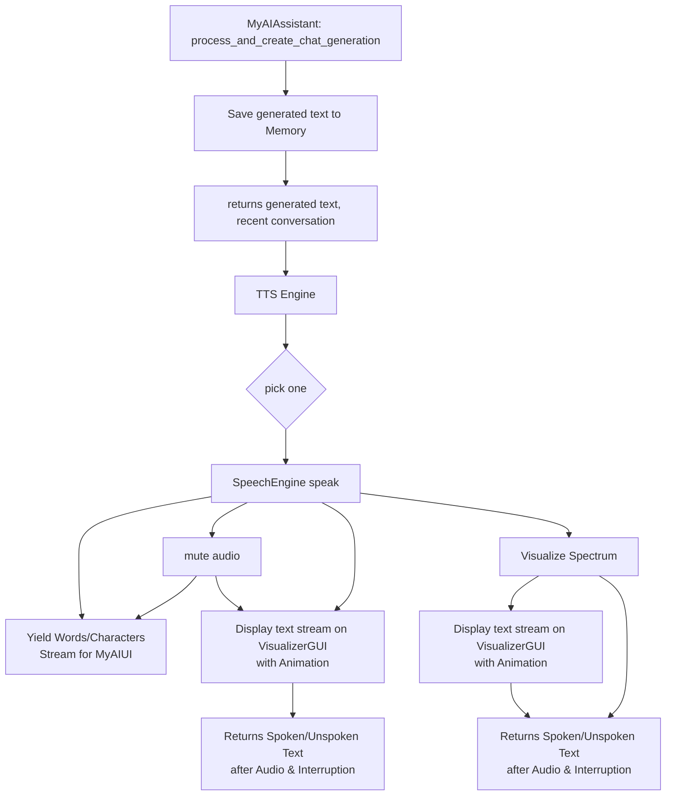

## MyAIAssistant

#### SpeechEngine Interfacing the UI with Assistant core

```mermaid
flowchart TD
    L[MIAIUI trigger Voice input] --> M[SpeechEngine listen]
    M --> N[transcribe into text]
    X[MIAIUI text input] --> Y[pre-process input to MessageContent]
    N --> Y
    Y --> Z[MyAIAssistant process_and_create_chat_generation]
```

```mermaid
flowchart TD
    A[MyAIAssistant: process_and_create_chat_generation] --> B[Save generated text to Memory]
    B --> C[returns generated text, recent conversation]
    C --> E[TTS Engine]
    E --> E1{pick one}
    
    E1 --> H[SpeechEngine speak]
    H --> I[Yield Words/Characters<br/>Stream for MyAIUI]
    H --> I1[mute audio]
    H --> H1[Display text stream on VisualizerGUI<br/>with Animation]
    H --> K[Visualize Spectrum]
    
    I1 --> I
    I1 --> H1
    
    K --> K1[Display text stream on VisualizerGUI<br/>with Animation]
    K --> L[Returns Spoken/Unspoken Text<br/>after Audio & Interruption]
    
    H1 --> J[Returns Spoken/Unspoken Text<br/>after Audio & Interruption]
    K1 --> L
```

#### VisionEngine Interfacing the UI with Assistant core
