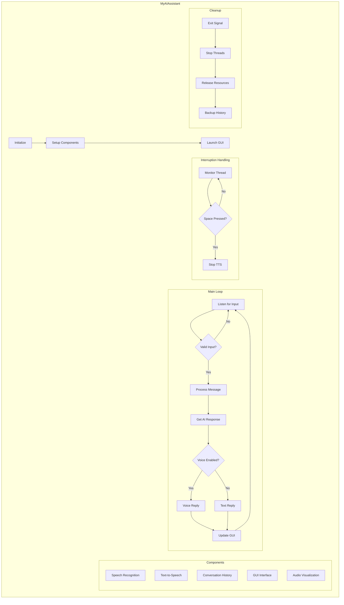
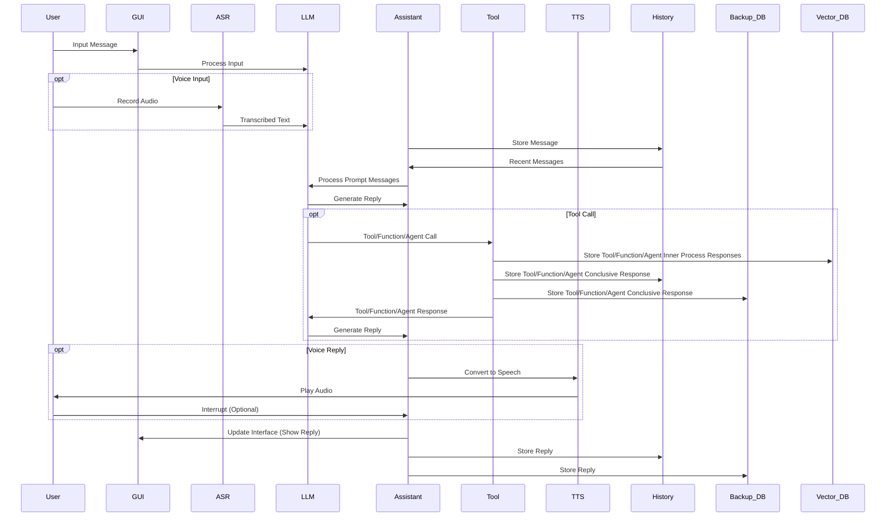
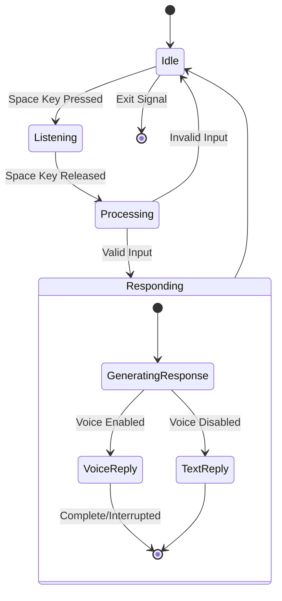

```mermaid
classDiagram
    class MyAIAssistant {
        +CHUNK: int
        +FORMAT: pyaudio.paInt16
        +CHANNELS: int
        +RATE: int
        +THRESHOLD: int
        +CHARS_PER_SECOND: int
        -computer: Thread
        -config: dict
        -inference_processor: object
        -conversation_history_engine: object
        -voice_reply_enabled: bool
        -tts_engine: object
        -asr_engine: object
        -interruption: bool
        -spoken_text: str
        -remaining_text: str
        -gui_interface: gr.Blocks
        -gui_visualizer: SpectrogramWidget
        +__init__()
        +split_text_into_chunks()
        +listen()
        +voice_reply()
        +monitor_audio_interruption()
        +backup_conversation_history()
        +__del__()
        +exit_gracefully()
        +create_gradio_ui()
        +update_chat_interface()
        +__run__()
        +run()
        +test_voice_reply()
    }

```

```mermaid
flowchart TB
    subgraph MyAIAssistant
        A[Initialize] --> B[Setup Components]
        B --> C[Launch GUI]
        
        subgraph Components
            D[Speech Recognition]
            E[Text-to-Speech]
            F[Conversation History]
            G[GUI Interface]
            H[Audio Visualization]
        end
        
        subgraph Main Loop
            I[Listen for Input] --> J{Valid Input?}
            J -->|Yes| K[Process Message]
            J -->|No| I
            K --> L[Get AI Response]
            L --> M{Voice Enabled?}
            M -->|Yes| N[Voice Reply]
            M -->|No| O[Text Reply]
            N --> P[Update GUI]
            O --> P
            P --> I
        end
        
        subgraph Interruption Handling
            Q[Monitor Thread] --> R{Space Pressed?}
            R -->|Yes| S[Stop TTS]
            R -->|No| Q
        end
        
        subgraph Cleanup
            T[Exit Signal] --> U[Stop Threads]
            U --> V[Release Resources]
            V --> W[Backup History]
        end
    end
```

```mermaid
sequenceDiagram
    participant User
    participant GUI
    participant ASR
    participant LLM
    participant Assistant
    participant Tool
    participant TTS
    participant History
    participant Backup_DB
    participant Vector_DB

    User->>GUI: Input Message
    GUI->>LLM: Process Input
    opt Voice Input
        User->>ASR: Record Audio
        ASR->>LLM: Transcribed Text
    end
    Assistant->>History: Store Message
    History->>Assistant: Recent Messages
    Assistant->>LLM: Process Prompt Messages
    LLM->>Assistant: Generate Reply

    opt Tool Call
        LLM->>Tool: Tool/Function/Agent Call
        Tool->>Vector_DB: Store Tool/Function/Agent Inner Process Responses
        Tool->>History: Store Tool/Function/Agent Conclusive Response
        Tool->>Backup_DB: Store Tool/Function/Agent Conclusive Response
        Tool->>LLM: Tool/Function/Agent Response
        LLM->>Assistant: Generate Reply
    end
    
    opt Voice Reply
        Assistant->>TTS: Convert to Speech
        TTS->>User: Play Audio
        User->>Assistant: Interrupt (Optional)
    end
    Assistant->>GUI: Update Interface (Show Reply)
    Assistant->>History: Store Reply
    Assistant->>Backup_DB: Store Reply
```

```mermaid
stateDiagram-v2
    [*] --> Idle
    Idle --> Listening: Space Key Pressed
    Listening --> Processing: Space Key Released
    Processing --> Responding: Valid Input
    Processing --> Idle: Invalid Input
    
    state Responding {
        [*] --> GeneratingResponse
        GeneratingResponse --> VoiceReply: Voice Enabled
        GeneratingResponse --> TextReply: Voice Disabled
        VoiceReply --> [*]: Complete/Interrupted
        TextReply --> [*]
    }
    
    Responding --> Idle
    Idle --> [*]: Exit Signal
```