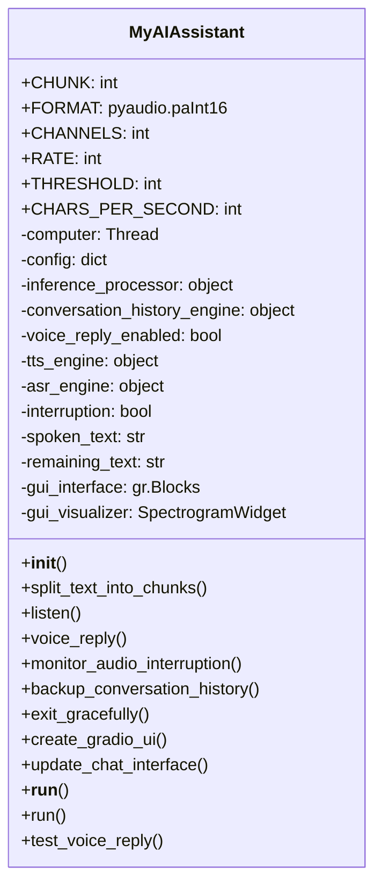
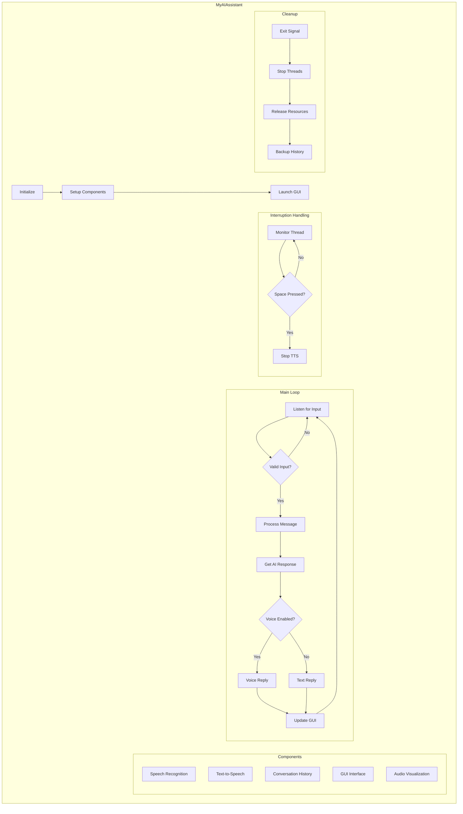
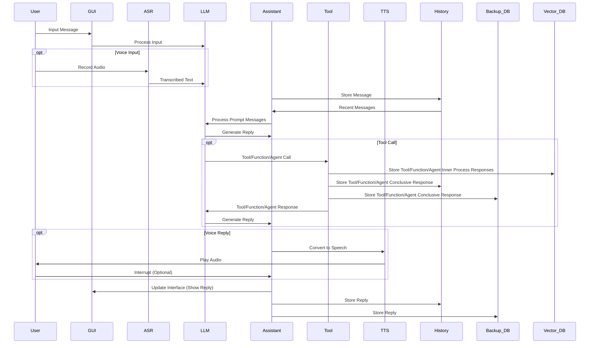
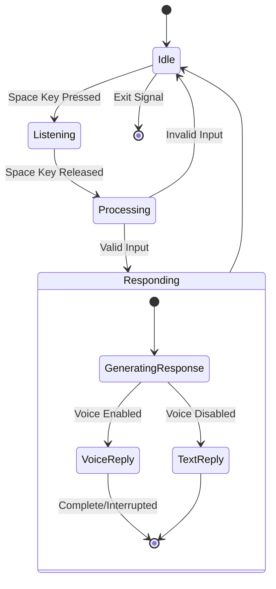
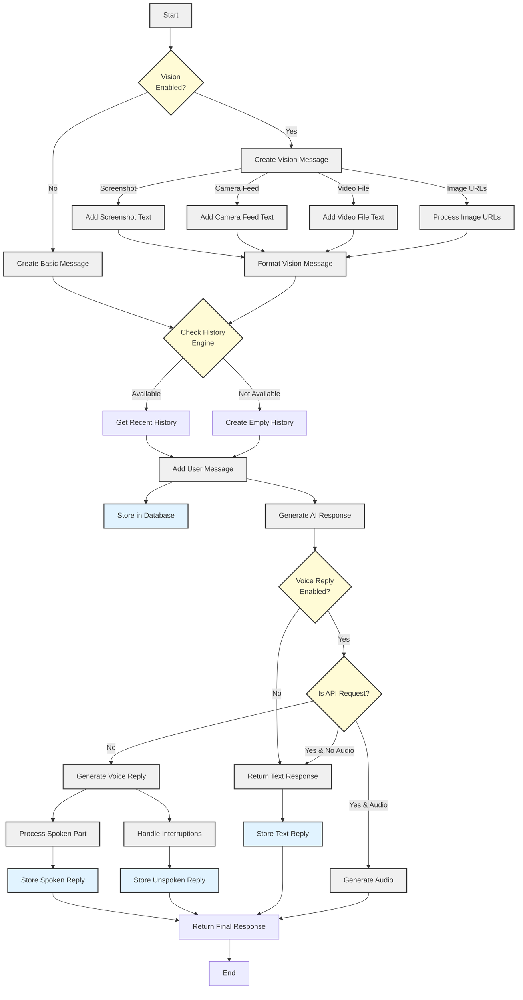

# process_and_create_chat_generation Flow

## Flow Description

### 1. Message Processing
- Checks if vision features are enabled
- Creates appropriate message format based on input type
- Handles different media types (screenshots, camera feed, video files, images)

### 2. Conversation History
- Verifies availability of conversation history engine
- Either retrieves existing conversation or creates new context
- Stores user message in database

### 3. AI Response Generation
- Processes conversation through inference engine
- Generates AI response based on context

### 4. Response Processing
Three main paths:
1. **Text Only**
   - Direct text response without voice
   - Stores in history and returns

2. **API Request**
   - Handles audio generation if requested
   - Returns combined audio and text response

3. **Voice Reply**
   - Generates voice output
   - Handles potential interruptions
   - Manages both spoken and unspoken parts
   - Stores all components in history

### 5. Final Response
- Formats appropriate response type
- Ensures all responses are stored in conversation history
- Returns formatted message segment